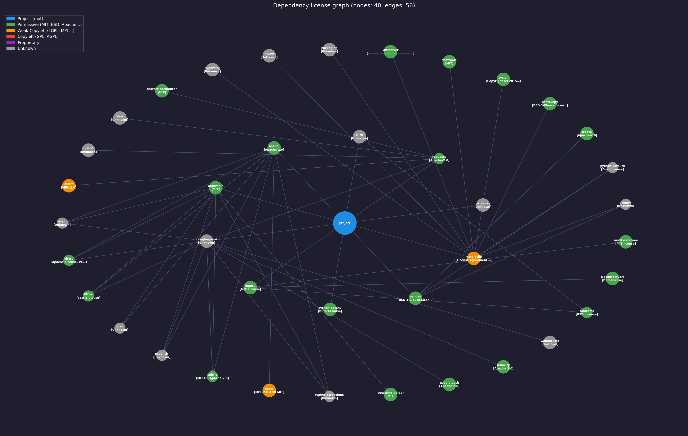
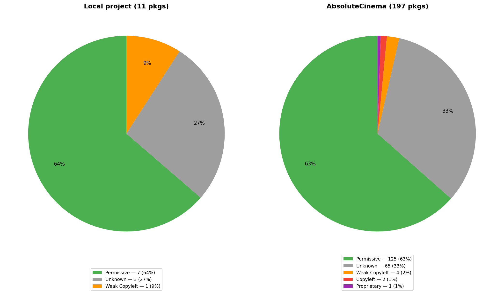
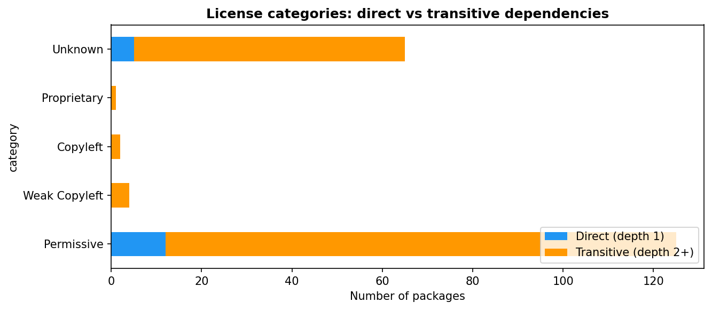
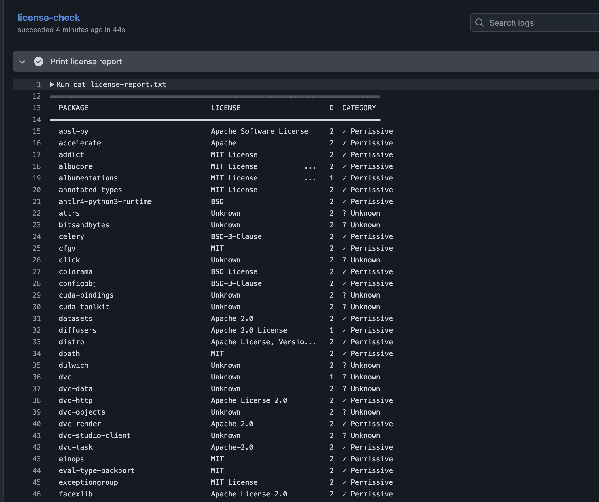

# Audyt licencji

**Autor:** Dawid Glinkowski, nr indeksu: 266509

**Temat:** 1 — Audyt licencji w repozytorium

**Kurs:** Aspekty prawne, społeczne i etyczne w AI, PWr 2025/2026

> Lista tematów: [Zasady zaliczenia — Menu mini-projektów](https://github.com/laugustyniak/ai-ethics-law-course/blob/main/Zasady%20zaliczenia.md#menu-mini-projekt%C3%B3w)

---

## Quick Start

```bash
uv sync                        # zainstaluj zależności
cp .env.example .env           # skopiuj wzór zmiennych środowiskowych
# uzupełnij klucze API w .env (opcjonalnie dla przykładów LLM)

# Uruchomienie audytu dla bieżącego projektu
uv run src/license_scanner.py --browser wyniki/graph.html --out wyniki/licenses.txt
```

---

## Cel projektu

Projekt służy do automatycznego audytu licencji bibliotek Python w drzewie zależności. Kluczowe cele to:
- **Identyfikacja ryzyk prawnych**: Wykrywanie licencji typu Copyleft (np. GPL), które mogą wymuszać udostępnienie kodu źródłowego projektu.
- **Wizualizacja zależności**: Tworzenie grafów (statycznych i interaktywnych) obrazujących strukturę projektu i powiązane z nią licencje.
- **Klasyfikacja automatyczna**: Przypisywanie licencji do kategorii (Permissive, Copyleft, Weak Copyleft, Unknown) na podstawie metadanych PyPI i słownika SPDX.
- **Opcjonalna AI explain**: Umowzliwia wstepne wyjasnienie warningu z uzyciem AI   

## Powiązanie z projektem grupowym

Mini-projekt jest luźno powiązany z projektem. Temat licencji uwazam za istotny ze względu na multum bilbliotek w pythonie i coraz popularniejszy vibe coding, który sprawia, ze ludzie traca kontrole nad kodem i agenci (badz inni kontrybutorzy) moga dodac zaleznosci, ktorych licencja jest nieodpowiednia
## Wymagania

Projekt korzysta z [uv](https://docs.astral.sh/uv/) — szybkiego menedżera pakietów Python.

```bash
# Instalacja uv (jeśli nie masz)
curl -LsSf https://astral.sh/uv/install.sh | sh

# Instalacja zależności
uv sync
```

## Uruchomienie

Skrypt `src/license_scanner.py` oferuje bogaty interfejs CLI (oparty o bibliotekę `click`):

```bash
# Podstawowy audyt (głębokość 2)
uv run src/license_scanner.py

# Pełny audyt (wszystkie zależności przechodnie) z interaktywnym grafem
uv run src/license_scanner.py --depth max --browser wyniki/pnw.html

# Audyt konkretnego katalogu i zapis do JSONL
uv run src/license_scanner.py /sciezka/do/projektu --out wyniki/audit.jsonl --out-type jsonl
```

**Dostępne flagi:**
- `--depth [int|max]`: Głębokość rekurencji (domyślnie 2).
- `--browser FILE`: Generuje interaktywny graf HTML (pyvis).
- `--output FILE`: Zapisuje statyczny graf PNG (matplotlib).
- `--out FILE`: Zapisuje tabelę wyników do pliku.
- `--out-type [pretty|jsonl]`: Format zapisu tabeli.
- `--layout [shell|spring|...]`: Algorytm ułożenia grafu.
- `--ai-explain`: Wyjaśnienie ostrzeżeń licencyjnych przez Gemini (wymaga `GOOGLE_API_KEY`).

## Wyniki

Przykładowe wyniki audytu dla projektu naukowo-wdrożeniowego (AbsoluteCinema — 197 pakietów, pełne BFS):

1. **Raport Tekstowy**: [wyniki/pnw.txt](wyniki/pnw.txt)
2. **Dane JSONL**: [wyniki/licenses_pnw.jsonl](wyniki/licenses_pnw.jsonl) — maszynowo przetwarzalny format
3. **Interaktywny Graf**: [wyniki/graph.html](wyniki/graph.html) (należy otworzyć w przeglądarce)
4. **Statyczna Wizualizacja**:
   
5. **Rozkład kategorii licencji** (porównanie local vs AbsoluteCinema):
   
6. **Direct vs transitive dependencies**:
   
7. **GH Actions**:
   
8. **AI Explanation**: [wyniki/ai-explaination.txt](wyniki/ai-explaination.txt) — analiza Gemini

### Podsumowanie kategorii (AbsoluteCinema)

| Kategoria | Liczba | Udział |
|-----------|--------|--------|
| Permissive | 125 | 63% |
| Unknown | 65 | 33% |
| Weak Copyleft | 4 | 2% |
| Copyleft | 2 | 1% |
| Proprietary | 1 | 1% |

## Wnioski merytoryczne

Na podstawie przeprowadzonego audytu (plik `wyniki/pnw.txt`, `wyniki/licenses_pnw.jsonl`) wyciągnięto następujące wnioski:

1. **Dominacja licencji Permissive**: Większość bibliotek (np. `anthropic`, `openai`, `pandas`) korzysta z licencji MIT, Apache 2.0 lub BSD, co jest bezpieczne dla projektów komercyjnych i naukowych.
2. **Ryzyko zależności przechodnich (Case study: `grandalf`)**: Skaner wykrył krytyczne ryzyko związane z pakietem `grandalf` (`GPLv2 | EPLv1`), który jest używany pośrednio przez bibliotekę `pyiqa` (licencja Apache). 
   - **Licencje nie znikają**: Licencja biblioteki nadrzędnej (Apache) nie nadpisuje licencji jej zależności. Kod `grandalf` wciąż podlega własnym obostrzeniom.
   - **Konflikt GPLv2 vs Apache**: Generalna niekompatybilność GPLv2 z licencją Apache oraz "wirusowy" charakter GPL mogłyby wymusić otwarcie kodu całego projektu.
   - **Mitygacja (Wybór EPLv1)**: Dzięki podwójnemu licencjonowaniu `grandalf`, rozwiązaniem jest zadeklarowanie korzystania z niego na warunkach **EPLv1** (Weak Copyleft), co pozwala na bezpieczne łączenie z kodem komercyjnym lub o innych licencjach.
3. **Copyleft w zależnościach przechodnich (`pygit2`)**: Pakiet `pygit2` (depth 3, zależność `scmrepo` → `dvc`) objęty jest licencją `GPLv2 with linking exception`. Wyjątek linkowania łagodzi "wirusowy" efekt GPL — pozwala na dynamiczne linkowanie bez konieczności otwierania kodu projektu, ale wszelkie modyfikacje samego `pygit2` muszą być udostępnione na GPLv2.
4. **Proprietary: `nvidia-cusparselt-cu13`**: Jedyny pakiet z licencją proprietary — `NVIDIA Proprietary Software License` (depth 2, zależność przechodnia od `torch`). Licencja NVIDIA zabrania redystrybucji poza kontekstem CUDA toolkit, ogranicza reverse engineering i może wymagać akceptacji EULA. W kontekście AI Act — użycie komponentów proprietary w systemie AI wysokiego ryzyka wymaga udokumentowania warunków licencji i ograniczeń, które mogą wpływać na przejrzystość i audytowalność systemu.
5. **Weak Copyleft (`certifi`, `pathspec`, `tqdm`, `asyncssh`)**: Cztery pakiety z licencjami MPL-2.0 lub EPL-2.0. MPL-2.0 wymaga udostępnienia zmian w plikach objętych licencją (file-level copyleft), ale nie „zaraża" reszty projektu. Praktyczne ryzyko jest niskie, o ile nie modyfikuje się kodu źródłowego tych bibliotek.
6. **Słaba jakość metadanych (Unknown)**: Znaczna liczba pakietów (33% w AbsoluteCinema) zwraca licencję `Unknown`. Wynika to z faktu, że autorzy na PyPI często wpisują nazwę licencji w polu `description` zamiast w dedykowanym polu `license`. Wymaga to ręcznej weryfikacji dla krytycznych komponentów.
7. **Weryfikacja w dobie "Vibe Coding"**: Automatyczny audyt staje się niezbędny przy korzystaniu z agentów AI i narzędzi low-code, które mogą nieświadomie dodawać zależności o restrykcyjnych licencjach do projektu.

## Ograniczenia

- **Ekosystem**: Obsługuje wyłącznie pakiety Python (PyPI). Brak wsparcia dla npm, cargo itp.
- **Zależność od PyPI**: Jeśli serwer PyPI jest niedostępny lub pakiet nie ma metadanych, skrypt nie może pobrać licencji.
- **Brak analizy kodu**: Skrypt polega na zadeklarowanych metadanych, nie skanuje plików `LICENSE` wewnątrz paczek (co byłoby wolniejsze, ale pewniejsze).

## Źródła

- [PyPI JSON API](https://warehouse.pypa.io/api-reference/json.html) — źródło metadanych.
- [SPDX License List](https://spdx.org/licenses/) — podstawa klasyfikacji.
- [NetworkX](https://networkx.org/) & [Pyvis](https://pyvis.readthedocs.io/) — silniki wizualizacji.
